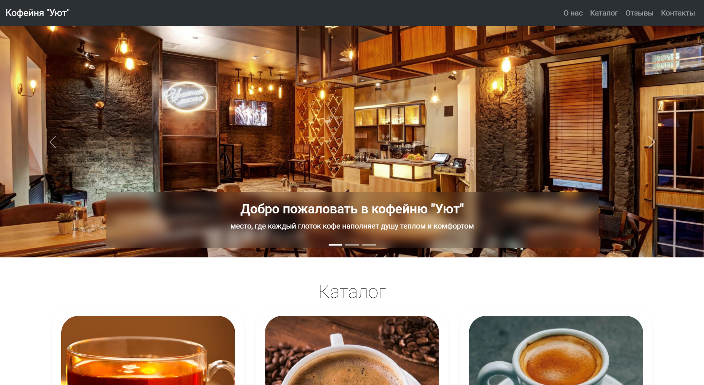

# Фронтенд сайта кофейни "Уют"

Сайт кофейни демонстрирует работу основных технологий HTML, CSS, JS

## Содержание

- [Технологии](#технологии)
- [Установка](#установка)
- [Скриншоты](#скриншоты)

## Технологии

Этот проект использует следующие технологии:

- [Bootstrap](https://getbootstrap.com/) - фреймворк для создания адаптивных веб-сайтов.
- HTML5
- CSS3
- JavaScript (встроенные инструменты Bootstrap)

## Установка

Чтобы запустить проект на своем локальном компьютере, выполните следующие шаги:

1. Склонируйте репозиторий:
```bash
git clone 'https://github.com/Ivanson-1/Cafe-Uiut--HTML-CSS-JS-Bootstrap'
```

2. Перейдите в директорию проекта:
```bash
cd Cafe-Uiut--HTML-CSS-JS-Bootstrap
```
   
3. Откройте файл index.html в вашем браузере.


## Скриншоты

Здесь представлена реализация основных элементов моего сайта




